# Overview

1. The biology of microbial DNA
1. Storage of samples intended for DNA extraction
1. DNA extraction
1. Library prep
1. Sequencing
1. Post-sequencing, pre-analysis data processing

---

## The biology of microbial DNA

# PCR is a key tool for manipulating DNA

Polymerase chain reaction (PCR) allows you to:

- *amplify* DNA in an exponential chain reaction
- amplify select DNA sequence regions using *primers*

# PCR works by repeatedly splitting and extending DNA

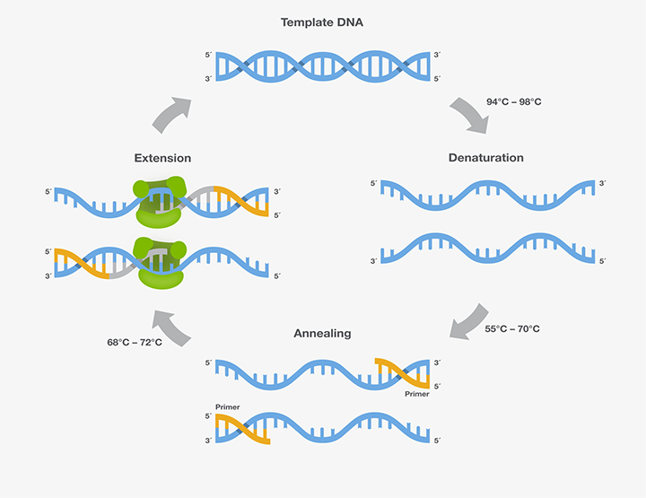{ width=60% }

footer: Thermo Fisher

# The 16S rRNA gene encodes part of the bacterial ribosome


footer: PDB. Orange = RNA. Blue = protein.

# The 16S gene has variable regions that can be PCR-amplified

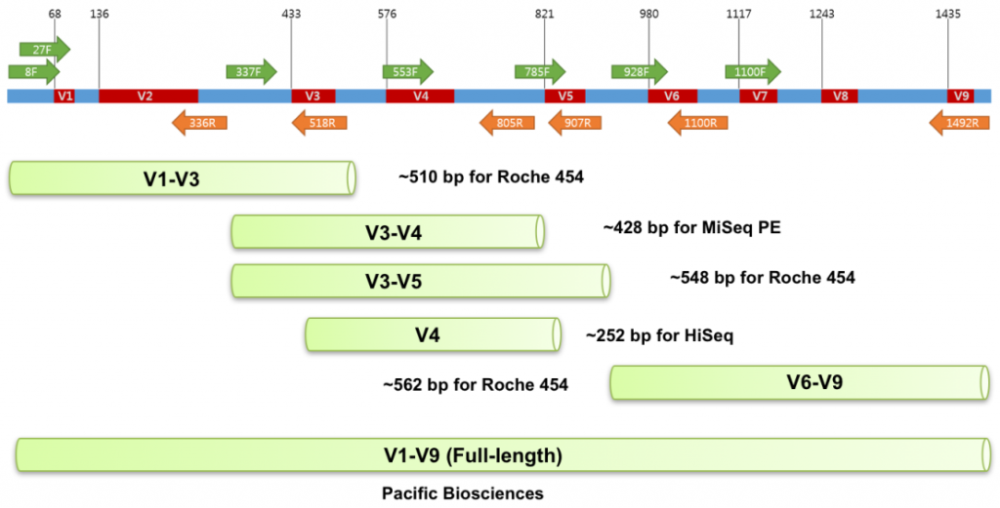{ width=80% }

# The variable regions in 16S have taxonomic information

DNA sequences with no clear biological function are preferred for determining taxonomy:

- Mutations occur at a regular rate, producing a "molecular clock".
- Convergent evolution won't lead to convergent taxonomies.

Human DNA fingerprinting uses highly variable, biologically irrelevant DNA sequences.

# The phylogeny of 16S led to a re-write of the tree of life

- Aristotle proposed a "two-kingdom" system: plants vs. animals
- The discovery of microbes led to a three-kingdom system: Plantae, Animalia, Protista
- Understanding of the eukaryote/prokaryote division led to four, adding Monera (and later, Fungi)
- The 16S phylogeny and later work led to a three-kingdom system: Archaea, Bacteria, and Eukaryota

# All DNA sequences are mapped onto references for analysis

- 16S sequences are mapped to known sequence-species maps to determine community taxonomic composition (e.g., Greengenes)
- Other sequences are mapped to known sequence-gene maps to determine community *functions* (e.g., UniParc)

---

## Sample collection & storage

# There are multiple methods for storing samples

- RNAlater (HCHS/SOL study)
- 95% ethanol kit (HMP2)
- OMNIgene Gut Kit (Personalized Nutrition Study)
- Anaerobic Stool Collection Kit
- Whatman FTA card (American Gut)

# There have advantages and disadvantages

- All of them (that I listed) preserve DNA.
- Most are thermostable (but glycerol is *not*).
- Only some preserve RNA (e.g., RNAlater).
- Only some (e.g., ethanol) preserve metabolites.
- Only some (e.g., glycerol) allow culturing.

---

## DNA extraction

# All extraction (or "isolation") methods follow similar steps

- Cell lysis: Mechanical (bead beading) or chemical (detergents)
- Break up lipids with detergents
- Break up proteins with protease
- Break up RNA with RNAse
- Use a concentrated salt to clump this debris
- Centrifugate to separate debris from supernatant with dissolved DNA
- Purify DNA in the supernatant

Methods differ most in how they do the final purification step

# Purification method 1 of 3: Ethanol precipitation

DNA is insoluble in alcohol, so it precipitates. Centrifugate and grab that pellet.

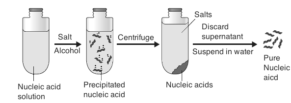

footer: technologyinscience.blogspot.com

# Purification method 2 of 3: Spin column purification

DNA is bound to silica beads, cleaned, and eluted.

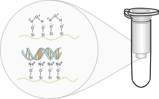

footer: wikipedia

# Purification method 3 of 3: Phenol-chloroform extraction

Lipids dissolve in the denser phenol-chloroform mixture; DNA stays in upper
aqueous phase; proteins remain at interface.

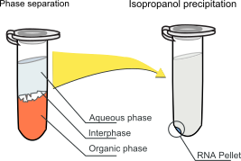

footer: wikipedia (AGPC extraction)

# Extraction methodology affects measured bacterial composition

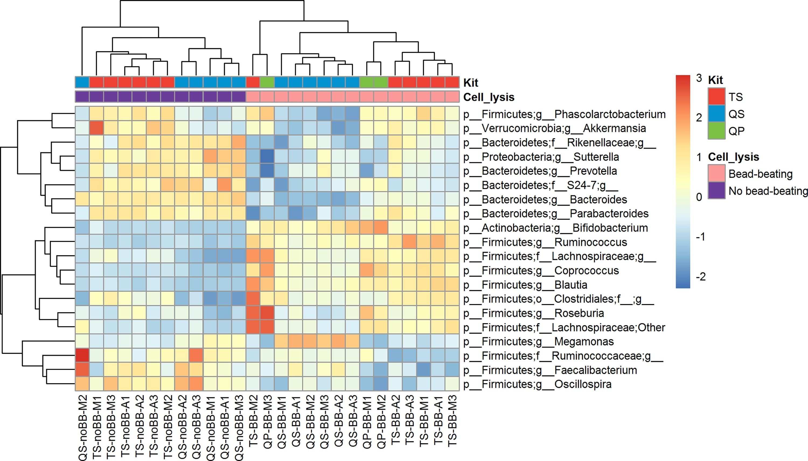{ width=75% }

---

## Library prep

# "Library prep": from DNA to something ready to sequence

This can include a few steps:

- *Fragmenting* the DNA, or amplifying *amplicons*
- Using PCR to add *adapters* that allow the sequencer to "grab" the DNA
- Using PCR to add *barcodes* that allow for multiplexing
- Pooling and normalizing multiple samples

"Tagmentation" means fragmentation and adding adapters.

# Pooling is one reason that sequencing data is compositional

The sequencer performs better, and data quality is better, when all samples
have the same library size.

This, and all the caveats about extraction, mean you get the *composition* of
sequences, not the *number*.

# Nomenclature about sequencing types mix up targets and technology

<small>

table:
 || || **Names** || **Technology**
Whole genome || one organism || "whole genome sequencing" || Illumina
 || multiple organisms || "metagenomics", "shotgun sequencing" || Illumina
16S rRNA gene || one organism || "Sanger" || Sanger sequencing
 || multiple organisms || "16S", "16S metagenomics" || Illumina

</small>

---

## Sequencing

# Illumina is the dominant sequencing technology today

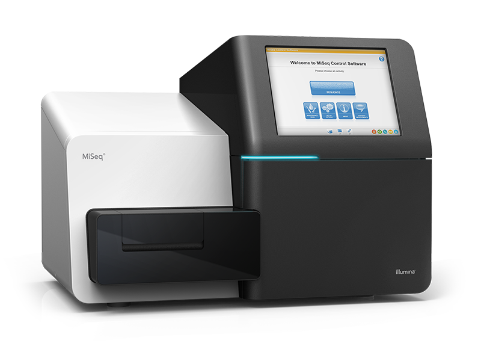{ width=45% }

<small>Also called "Solexa" because Illumina bought that company and its sequencing technology</small>

footer: Illumina MiSeq

# Other "next-generation" sequencing methods are less-often used

- Pacific Biosciences ("PacBio")
- Roche 454 ("454" or "pyrosequencing")
- Ion Torrent
- Helicos

# Illumina sequencing adapters allow DNA to attach to the flow cell

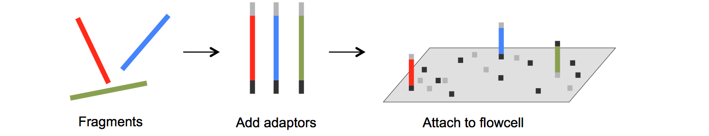

# Bridge amplification forms clusters of identical DNA strands

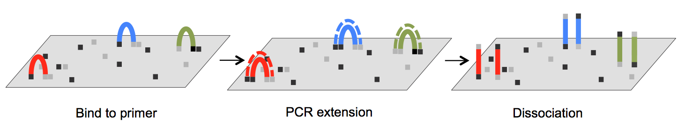

# "Sequencing by synthesis" lights up one color per cluster per base

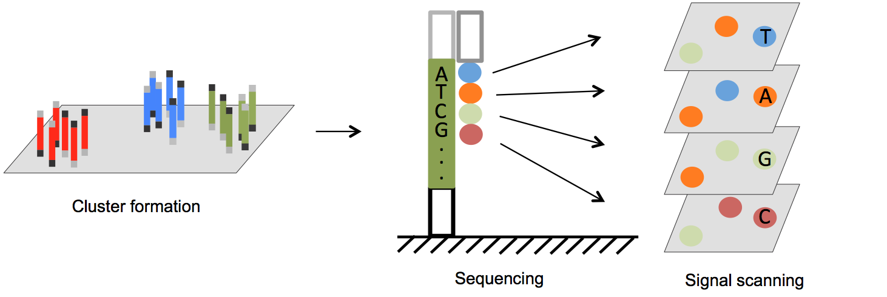

# "This" generation sequencing means Sanger sequencing

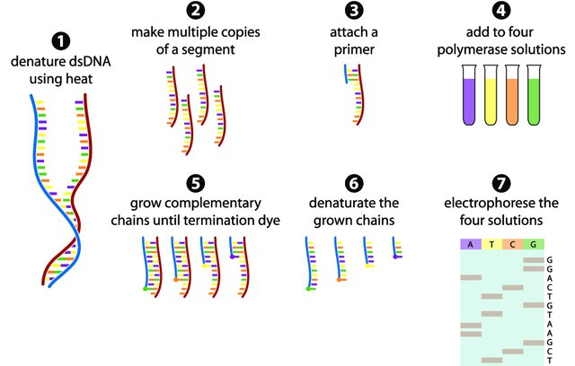

footer: Gauthier, PhD thesis, U Ottawa (2017)

# "Next-next" includes nanopore sequencing

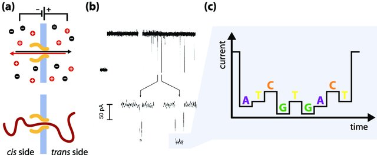

footer: Gauthier, PhD thesis, U Ottawa (2017)

---

## Data: from sequencer to analysis

# There are multiple steps from the sequencer to analysis-ready data

- The sequences outputs *BCL* ("base call") files.
- It probably also processes them into *FASTQ* files (sequence reads with Quality).
- The user might *demultiplex* the reads.
- The user must process the FASTQs into a FASTA (just sequence reads).

# BCL ("base call") files

A BCL file has one record for each cluster/color measurement:

- Cluster ID (cross-referenced with other files giving the cluster location)
- The base (`ACTG`) measured
- The quality of the measurement (i.e., the probability the base call is right)

A "filter file" says if the whole cluster met some quality criteria.

# FASTQ files are just rearranged BCLs

A FASTQ file has one record per read (i.e., cluster):

- Read ID (usually with some information about the cluster)
- The measured bases
- Quality scores by base

# The FASTQ format is information dense

```
@61JFDAAXX100430:7:100:10000:13168/1    <- ID line
CACCACCACGGCGTACCTCTATTCCACCTATGAACG... <- base calls
+61JFDAAXX100430:7:100:10000:13168/1    <- repeated ID line
?CCC=A;AA-27=3=?C;CC?CAC-CCAC@C??B=B... <- quality scores
```

footer: HMP SRS013215

# Demultiplexing makes multiple-genome sequencing affordable

To avoid having one sample per sequencing lane, you add "a unique index adapter
sequence", or "badcode", to each sample during library prep.

Demultiplexing then assigns clusters to a sample based on the index adapter
sequence of the cluster.

footer: bcl2fastq documentation

# Quality information is used to "clean" the data

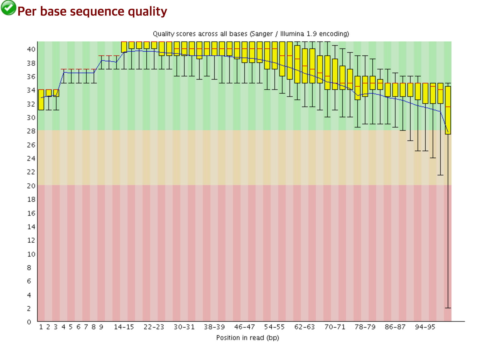{ width=55% }

*A "good" quality sample*

# Quality information is used to "clean" the data

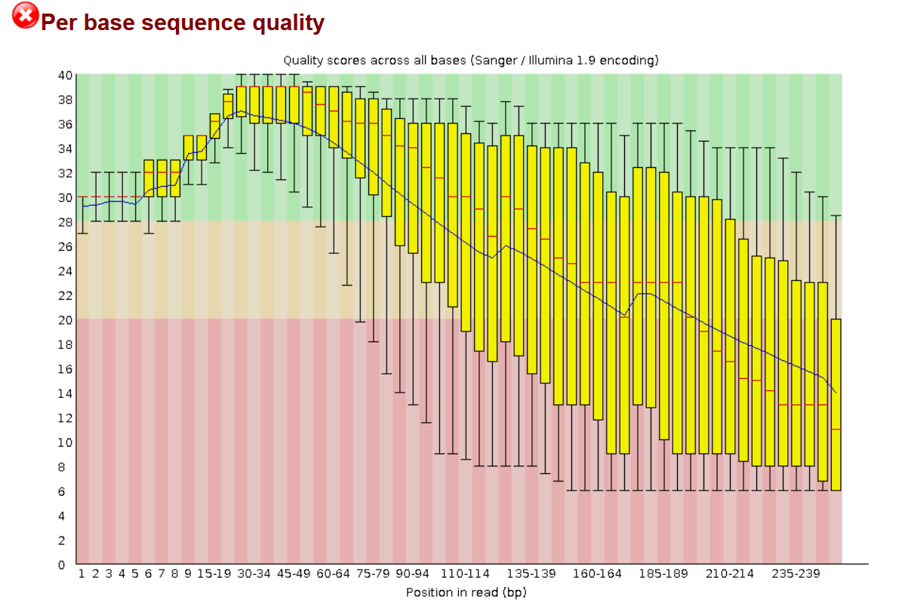{ width=55% }

*A "bad" quality sample*

# Quality "cleaning" has many adjustable steps

- *Trimming*: cut off the unreliable base calls at the end of a read
- *Filtering*: throw away overall unreliable reads
- *Stitching/assembling/merging/joining*: Join forward and reverse reads
- *Chimera slaying*: throw away "chimeric" sequences

# FASTA files are way simpler

It's like FASTQ, but with different syntax and no quality information.

```
>61JFDAAXX100430:7:100:10000:13168/1 <- ID line
CACCACCACGGCGTACCTCTATTCCACCTATGAACG <- base calls
AAGCCGCATCAGCGAAGCTGATCCTACCGACA
```

And *now* you can go onto doing microbiome analysis!
